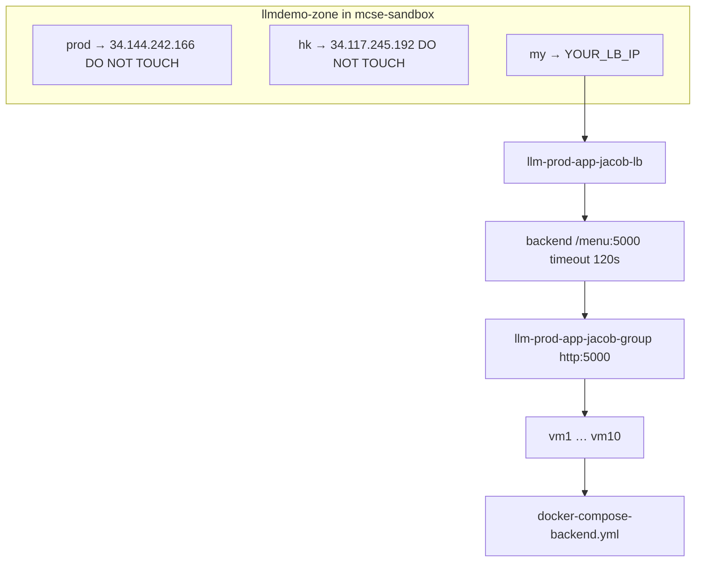

# LLM Demo — Local Agent Deployment Plan

> **How to use this file with a local Cursor agent**
>
> 1. Pull this file into your local repo: `git pull origin cursor/fix-langchain-pins-4368` (or copy this file manually).
> 2. Open the repo in Cursor on your computer.
> 3. Start a **local** agent and paste the prompt in [Agent Prompt](#agent-prompt-copy-paste) below.
> 4. The agent should execute steps on **your machine** — not a cloud VM. All `gcloud` and `docker` commands run locally.

---

## Agent Prompt (copy-paste)

```
Read DEPLOYMENT-PLAN.md in this repo and execute Phase 1 (steps 0–7).

Goal: deploy the stock LLM Demo app at https://my.dd-demo-sg-llm.com/
- GCP project: mcse-sandbox
- Own LB + 10 VMs (standalone — do not reuse prod/hk infrastructure)
- DNS: add A record my.dd-demo-sg-llm.com in existing llmdemo-zone
- Do NOT reskin yet — verify stock app works first

Before GCP deploy, ensure local Docker works:
- requirements.txt must pin langchain 0.1.x (see "Local Docker Fix" section)
- docker compose -f docker-compose-backend.yml build --no-cache
- curl http://127.0.0.1:5000/menu returns HTML

Confirm with me before creating billable GCP resources (10x n1-standard-8 VMs).
```

---

## Important Context (from cloud agent session)

### Cloud agent vs local machine

- A **cloud agent** edits files on a **remote VM**. Those changes are **not** on your laptop unless you `git pull` or copy files manually.
- **Docker on your laptop** reads **local files only**.
- This plan was written during a cloud agent session; this file brings that context to your local machine.

### Local Docker fix (required before GCP)

Unpinned `langchain>=0.1.0` installs **LangChain 1.3.x** today, which breaks the app:

```
ModuleNotFoundError: No module named 'langchain.chains'
```

**Fix — pin in `requirements.txt`:**

```txt
langchain==0.1.20
langchain-core==0.1.53
langchain-openai==0.1.7
langchain-community==0.0.38
```

**Fix — add build check in `Dockerfile` after pip install:**

```dockerfile
RUN pip install --upgrade pip && pip install -r requirements.txt \
    && python -c "import langchain; from langchain.chains import RetrievalQA; v=langchain.__version__; assert v.startswith('0.1.'), f'Expected langchain 0.1.x, got {v}'"
```

**Verify locally:**

```bash
grep langchain requirements.txt          # must show ==0.1.20
docker compose -f docker-compose-backend.yml build --no-cache
docker compose -f docker-compose-backend.yml up -d
docker compose -f docker-compose-backend.yml exec app pip show langchain  # must show 0.1.20
curl http://127.0.0.1:5000/menu          # must return HTML
```

**Branch with these fixes:** `cursor/fix-langchain-pins-4368`

### Frontend is not separate

There is no separate frontend deploy. Flask serves `templates/` + `static/` from the same container (`docker-compose-backend.yml`). Reskin = edit those files + redeploy.

---

## What This Application Is

Flask LLM security demo with two experiences:

| Experience | Route | Purpose |
|---|---|---|
| Guardrail CTF | `/ctf` | Prompt-injection guardrail bypass |
| TechBot | `/business` | RAG + LLM security evaluation demo |

Health check: `GET /menu` on port 5000.

**Key repo docs:**
- `README Documentations/README.md`
- `APPLICATION-CODE-ARCHITECTURE.md`
- `README Documentations/DEPLOYMENT-GUIDE.md`

---

## Architecture



### GCP resource names (yours)

| Resource | Name |
|---|---|
| Instance group | `llm-prod-app-jacob-group` |
| Load balancer | `llm-prod-app-jacob-lb` |
| Static IP | `llm-prod-app-jacob-lb-ip` |
| Backend service | `llm-prod-app-jacob-backend` |
| Health check | `llm-prod-app-jacob-health-check` |
| SSL cert | `llm-prod-app-jacob-cert` (domain: `my.dd-demo-sg-llm.com` only) |
| VMs | `llm-prod-app-jacob-vm1` … `vm10` |
| Network tag | `llm-prod-app-jacob-backend` |
| VM project dir | `~/llmdemo-prod` |
| **Your URL** | `https://my.dd-demo-sg-llm.com/` |

Application names stay unchanged: `llm-play-app`, `DD_SERVICE=llm-play-app`.

---

## DNS Strategy

Reuse existing zone **`llmdemo-zone`** for `dd-demo-sg-llm.com`. No new domain, no nameserver changes.

| Hostname | IP | Action |
|---|---|---|
| `prod.dd-demo-sg-llm.com` | `34.144.242.166` | Do not change |
| `hk.dd-demo-sg-llm.com` | `34.117.245.192` | Do not change |
| `my.dd-demo-sg-llm.com` | your new LB IP | Add in step 5 |

---

## Phase 1 — Launch Steps

**Strategy:** deploy vanilla app → verify at `my.dd-demo-sg-llm.com` → reskin in Phase 2.

| Step | Action | Done when |
|---|---|---|
| 0 | Prerequisites | API keys ready; DNS zone confirmed |
| 1 | Reserve static IP | IP saved |
| 2 | 10 VMs + firewall + startup script | `docker compose version` on vm1 |
| 3 | Deploy app on all VMs | `/menu` → 200 on every VM |
| 4 | GCP LB + SSL | LB created; cert for `my.dd-demo-sg-llm.com` |
| 5 | DNS A record in `llmdemo-zone` | `dig my.*` shows your IP |
| 6 | Verify | SSL ACTIVE; backends Healthy |
| 7 | Create `deploy-to-jacob-vms.sh` | Ongoing deploy ready |

### Step 0 — Prerequisites

```bash
gcloud auth login
gcloud config set project mcse-sandbox
gcloud services enable compute.googleapis.com dns.googleapis.com
```

**DNS (already confirmed):**

```bash
gcloud dns managed-zones describe llmdemo-zone
dig prod.dd-demo-sg-llm.com A +short   # 34.144.242.166
dig hk.dd-demo-sg-llm.com A +short     # 34.117.245.192
```

**API keys** (create `.env` on each VM in step 3):

```bash
OPENAI_API_KEY=...    # required
DD_API_KEY=...        # required
DD_APP_KEY=...        # required
EPPO_API_KEY=...      # optional
```

**Optional local test first:**

```bash
docker compose -f docker-compose-backend.yml up -d --build
curl http://127.0.0.1:5000/menu
```

### Step 1 — Reserve static IP

```bash
gcloud compute addresses create llm-prod-app-jacob-lb-ip --global
gcloud compute addresses describe llm-prod-app-jacob-lb-ip --global --format="get(address)"
```

### Step 2 — VMs + firewall

**VM spec:** COS `cos-stable`, `n1-standard-8`, 50GB `pd-ssd`, zone `us-central1-a`

**Create `vm-startup.sh`:**

```bash
cat > vm-startup.sh << 'EOF'
#!/bin/bash
curl -sSL \
  https://github.com/docker/compose/releases/download/v2.23.3/docker-compose-linux-x86_64 \
  -o /var/lib/google/docker-compose
chmod o+x /var/lib/google/docker-compose
mkdir -p /etc/docker/cli-plugins
ln -sf /var/lib/google/docker-compose /etc/docker/cli-plugins/docker-compose
docker compose version
EOF
```

**Create 10 VMs:**

```bash
gcloud compute instances create \
  llm-prod-app-jacob-vm1 llm-prod-app-jacob-vm2 llm-prod-app-jacob-vm3 \
  llm-prod-app-jacob-vm4 llm-prod-app-jacob-vm5 llm-prod-app-jacob-vm6 \
  llm-prod-app-jacob-vm7 llm-prod-app-jacob-vm8 llm-prod-app-jacob-vm9 \
  llm-prod-app-jacob-vm10 \
  --zone=us-central1-a \
  --machine-type=n1-standard-8 \
  --image-family=cos-stable \
  --image-project=cos-cloud \
  --boot-disk-size=50GB \
  --boot-disk-type=pd-ssd \
  --tags=llm-prod-app-jacob-backend \
  --labels=please_keep_my_resource=true \
  --metadata-from-file=startup-script=vm-startup.sh
```

**Firewall:**

```bash
gcloud compute firewall-rules create llm-prod-app-jacob-allow-health-checks \
  --network=default --action=allow --direction=ingress \
  --source-ranges=130.211.0.0/22,35.191.0.0/16 \
  --target-tags=llm-prod-app-jacob-backend --rules=tcp:5000

gcloud compute firewall-rules create llm-prod-app-jacob-allow-http \
  --network=default --action=allow --direction=ingress \
  --source-ranges=0.0.0.0/0 \
  --target-tags=llm-prod-app-jacob-backend --rules=tcp:5000
```

### Step 3 — Deploy app on VMs

```bash
PROJECT_DIR=llmdemo-prod
FORK_URL=https://github.com/jacoblimzm/llmdemo-prod-op.git   # or your fork
ZONE=us-central1-a
```

On each VM: clone repo, create `.env`, run compose.

```bash
for i in $(seq 1 10); do
  VM="llm-prod-app-jacob-vm$i"
  gcloud compute ssh $VM --zone=$ZONE --command="
    git clone $FORK_URL $PROJECT_DIR || (cd $PROJECT_DIR && git pull)
    test -f $PROJECT_DIR/.env || { echo 'CREATE .env ON $VM FIRST'; exit 1; }
    cd $PROJECT_DIR && docker compose -f docker-compose-backend.yml up -d --build
    curl -sf http://localhost:5000/menu && echo ' OK' || echo ' FAILED'
  "
done
```

Use branch `cursor/fix-langchain-pins-4368` on VMs (checkout after clone).

### Step 4 — GCP Load Balancer

Console: **Network Services → Load balancing → Create** → name `llm-prod-app-jacob-lb`

1. Application Load Balancer → Global external → HTTPS
2. Backend: instance group `llm-prod-app-jacob-group`, named port `http:5000`, health check `/menu`, timeout **120s**
3. Frontend: IP `llm-prod-app-jacob-lb-ip`, SSL cert for **`my.dd-demo-sg-llm.com` only**
4. Create

### Step 5 — DNS

```bash
LB_IP=$(gcloud compute addresses describe llm-prod-app-jacob-lb-ip --global --format="get(address)")

gcloud dns record-sets transaction start --zone=llmdemo-zone
gcloud dns record-sets transaction add $LB_IP \
  --name=my.dd-demo-sg-llm.com. --ttl=300 --type=A --zone=llmdemo-zone
gcloud dns record-sets transaction execute --zone=llmdemo-zone

dig my.dd-demo-sg-llm.com A +short
```

### Step 6 — Verify

```bash
gcloud compute backend-services get-health llm-prod-app-jacob-backend --global
curl -I https://my.dd-demo-sg-llm.com/menu
curl -sf https://my.dd-demo-sg-llm.com/ctf && echo "CTF OK"
curl -sf https://my.dd-demo-sg-llm.com/business && echo "Business OK"
```

### Step 7 — Ongoing deploys

Copy `deploy-to-vms.sh` → `deploy-to-jacob-vms.sh`, update VM names and `PROJECT_DIR=llmdemo-prod`.

---

## Launch Checklist

**Before GCP:**
- [x] DNS zone `llmdemo-zone` access confirmed
- [x] Subdomain: `my.dd-demo-sg-llm.com`
- [ ] LangChain pins in `requirements.txt` (local + VM builds)
- [ ] Local Docker works: `curl http://127.0.0.1:5000/menu`
- [ ] API keys ready

**Infrastructure (1–2):**
- [ ] Static IP reserved
- [ ] 10 VMs + firewall + startup script

**Application (3):**
- [ ] `.env` on all 10 VMs
- [ ] App running on all VMs

**Go-live (4–6):**
- [ ] LB + SSL for `my.dd-demo-sg-llm.com`
- [ ] A record added; prod/hk unchanged
- [ ] HTTPS endpoints work

**After Phase 1:**
- [ ] `deploy-to-jacob-vms.sh` created

---

## Phase 2 — Reskin (after verify)

| What | Files |
|---|---|
| UI | `static/style.css`, `templates/*.html` |
| RUM domains | Add `my.dd-demo-sg-llm.com` to `allowedTracingUrls` in all templates |
| AI persona | `src/workflows.py`, `src/evaluation*.py`, `src/database.py` |

Then: `git push` + `./deploy-to-jacob-vms.sh`

---

## Known Gaps

1. **git on COS** — may be missing; verify on vm1
2. **No `.env.example`** in repo — create `.env` manually
3. **`secrets` table** — `src/rag.py` queries table not in `src/database.py` init
4. **RUM** — templates hardcode `prod.dd-demo-sg-llm.com` until Phase 2
5. **Cost** — 10 × `n1-standard-8` ≈ ~$2,400/mo

---

## Do-Not-Touch

- `prod.dd-demo-sg-llm.com` → `34.144.242.166`
- `hk.dd-demo-sg-llm.com` → `34.117.245.192`
- Teammate LB/VM resources

---

## Common Mistakes

| Mistake | Result |
|---|---|
| Unpinned langchain in requirements.txt | App crashes — langchain 1.x installed |
| Docker build cache after requirements change | Old packages remain — use `--no-cache` |
| DNS points at VM IP not LB IP | SSL fails |
| Missing health-check firewall ranges | Backends Unhealthy |
| Wrong named port (not `http:5000`) | Health checks fail |
| Editing prod/hk DNS records | Breaks teammate apps |

---

*Generated from cloud agent session bc-a9afa015-d750-4dbb-a194-7e06dca04368*
